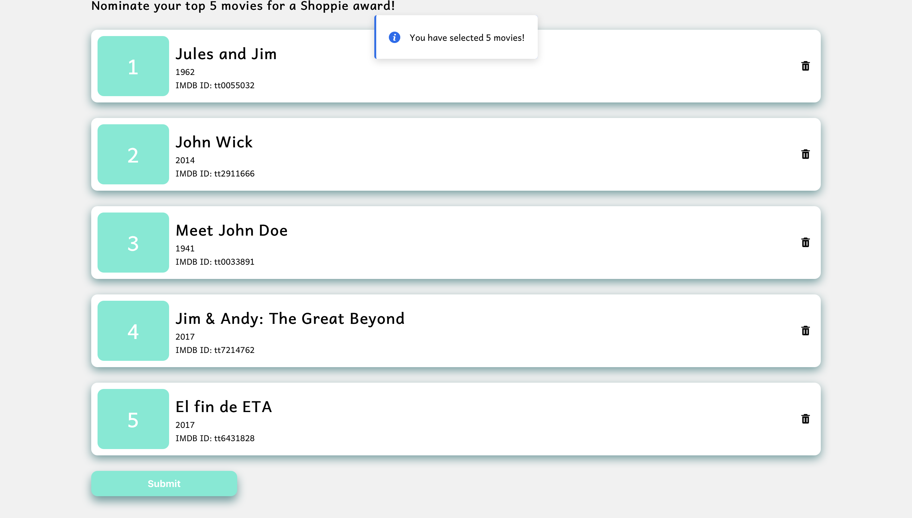

# Overview

This repo contains the source code for my Shopify 2020 internship challenge. The app is live at https://nicholas-chong.github.io/shopifychallenge/

# Challenges

Here are some of the challenges I faced (and overcame) during the development of the project.

## Creating the UI

The first challenge was to create a UI that was remained functional while looking good on desktops/laptops and mobile devices. I settled on a simple card-based design, in which each card represents one of the user's movie nominations, along with popups for searching and nominating a movies. For the more visual aspects of the UI, such as colours and drop shadows, I took design inspiration from the [ClickUp](https://clickup.com) website. 

## Managing States/Props

To create the Card component, I decided compose a series of other components. The general structure of the Card component is: 

Card -> SkyLight (a popup component), NominationModal (the popup content component)

Card is the top level component that shows the user their current selection.

SkyLight is a popup from the library 'react-skylight'.

NominationModal is allows the user to search for movies and select the movie they would like to nominate.

As a novice React user, I struggled to figure out a way to get the user actions in NominationModal to influence the state of Card. However, after trying various solutions (including an very ugly one with global variables) I realized that React elements could be passed to children as props. Using this React feature, I was able to inflict changes on the top level component by calling its setState() function, and initiate the associated UI changes accordingly.

# Samples 

|:-------------------------:|:-------------------------:|
|  Homepage |   Nominate movie popup |
| Banner |   Submit popup |

# Stack

React, JavaScript, GitHub Pages
